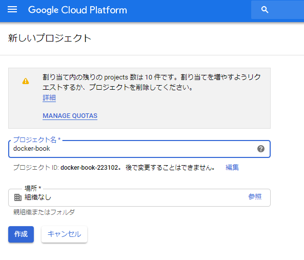
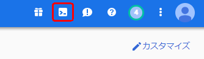
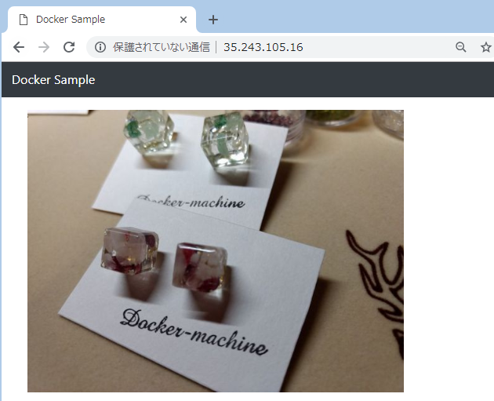
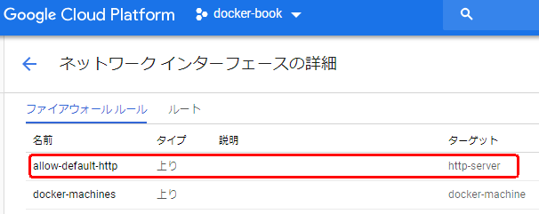

name: inverse
layout: true
class: center, middle, inverse

---
.zoom2[
# GCP入門
]

---
layout: false
## 動機

コンテナの勉強のためGCPを利用することになったので、軽く内容をまとめて紹介する  
みんな使えばいいと思う

---
## 対象者

* クラウドサービス未経験
* GCP未経験

## 目標

* GCPの大まかな機能を把握
* VMの作成

---
## アウトライン

* GCPの概要
* GCPの機能
* GCEを使用したVM作成

---
class: center, middle, inverse
# GCPの概要

---
## Google Cloud Platform(GCP)

公式サイト  
<https://cloud.google.com/>

* Googleが提供するクラウドコンピューティングサービス
* Google Search や Youtube と同じ基盤で稼働している
* コンピューティング、ストレージ、データ分析、機械学習など様々な機能を提供
* 世界中に17リージョン、52ゾーンを展開

---
## 各社クラウドサービス

* Microsoft Azure
* Google Cloud Platform(GCP)
* Amazon Web Service(AWS)
* IBM Cloud
* Oracle Cloud

etc...

---
class: center, middle, inverse
# GCPの機能

---
## GCPの機能

* App Engine
* Compute Engine
* Kubernetes Engine
* BigQuery
* ML Engine

etc...

---
.zoom1[
## App Engine(GAE)

公式サイト  
<https://cloud.google.com/appengine/>

* Webアプリケーションの開発、ホスティング
* PaaS
* リクエストの増加に合わせて自動スケーリング
* PHP用、Python用、Java用、Go用にそれぞれSDKが用意されている
* SQLに似たデータストア、GQLを使用


]

---
## Compute Engine(GCE)

公式サイト  
<https://cloud.google.com/compute/>

* VMの作成
* IaaS
* デベロッパーコンソール、Restful API、CLIでアクセス


---
## Kubernetes Engine(GKE)

公式サイト  
<https://cloud.google.com/kubernetes-engine/>

* Kubernetes を利用したコンテナオーケストレーション
* Container as a Service
* 本家


---
## BigQuery

公式サイト  
<https://cloud.google.com/bigquery/>

* データウェアハウス
* ビッグデータへの高速なクエリ実行と高度な解析

---
class: center, middle, inverse
# GCEを使用したVM作成

---
.zoom1[
## プロジェクトの作成


]

---
## Cloud Shellの起動

画面右上のボタン



画面下にShellが起動

.zoom1[
```console
Welcome to Cloud Shell! Type "help" to get started.
Your Cloud Platform project in this session is set to docker-book-223015.
Use “gcloud config set project [PROJECT_ID]” to change to a different project.
account@cloudshell:~ (docker-book-223015)$
```
]

---
## VMの作成

Docker Machineを作成する  
(「プログラマのためのDocker教科書 第2版」より)

.zoom1[
```console
$ docker-machine create --driver google \
  --google-project $PROJECT_ID \
  --google-zone asia-northeast1-a \
  --google-machine-type f1-micro \
  --google-tags 'http-server' \
  --google-machine-image https://www.googleapis.com/compute/v1/projects/ubunt
u-os-cloud/global/images/family/ubuntu-1604-lts \
  gcp-host

```
]

---
## 実行環境の作成

.zoom1[
Docker実行環境の確認

```console
$ docker-machine ls
```

sshでアクセス

```console
$ docker-machine ssh gcp-host

```

コンテナの起動

```console
docker-user@gcp-host:~/ $ sudo docker container run --name webserver -it -p 
80:80 asashiho/photoview-image
```
]

---
.zoom1[
## ブラウザからアクセス


]

---
## 注意点

VPCネットワークのファイアウォール ルールでhttpアクセスを許可しないと、ブラウザでアクセスできない



---
## 参考  

書籍  
[プログラマのためのDocker教科書 第2版](https://www.amazon.co.jp/%E3%83%97%E3%83%AD%E3%82%B0%E3%83%A9%E3%83%9E%E3%81%AE%E3%81%9F%E3%82%81%E3%81%AEDocker%E6%95%99%E7%A7%91%E6%9B%B8-%E7%AC%AC2%E7%89%88-%E3%82%A4%E3%83%B3%E3%83%95%E3%83%A9%E3%81%AE%E5%9F%BA%E7%A4%8E%E7%9F%A5%E8%AD%98-%E3%82%B3%E3%83%BC%E3%83%89%E3%81%AB%E3%82%88%E3%82%8B%E7%92%B0%E5%A2%83%E6%A7%8B%E7%AF%89%E3%81%AE%E8%87%AA%E5%8B%95%E5%8C%96-WINGS%E3%83%97%E3%83%AD%E3%82%B8%E3%82%A7%E3%82%AF%E3%83%88/dp/4798153222)

サイト  
[Wikipedia - Google Cloud Platform](https://en.wikipedia.org/wiki/Google_Cloud_Platform)  

